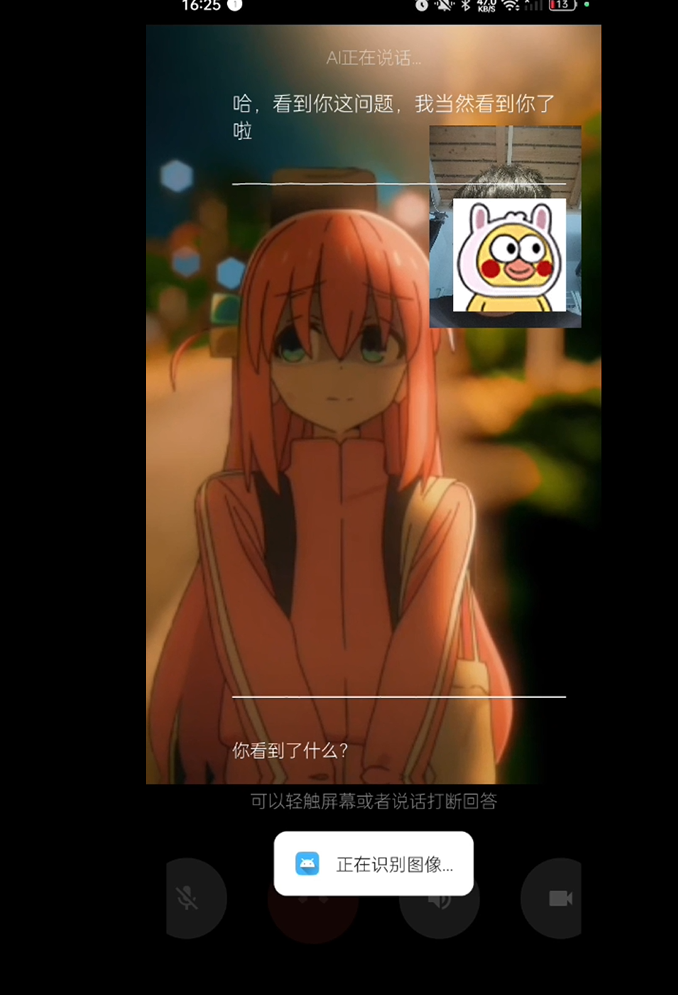

# 小智AI助手 Android客户端

一个基于WebSocket的Android语音对话应用,支持实时语音交互和文字对话。+初步识别


<p align="center">
  
</p>

[查看源软件演示视频](https://m.bilibili.com/video/BV19QPHeHEJm?buvid=XU9C15B983E5B3201C25FDE381B1F1C4C33D5&from_spmid=dt.space-dt.video.0&is_story_h5=false&mid=5zOL0pVwHX2%2BpSNDC91few%3D%3D&p=1&plat_id=114&share_from=ugc&share_medium=android&share_plat=android&share_session_id=8f4e8fb2-fbc5-41ad-b488-fdbb2423aed4&share_source=WEIXIN&share_tag=s_i&spmid=united.player-video-detail.0.0&timestamp=1740629989&unique_k=CR9irtn&up_id=1145920831)

[查本项目演示视频](【安卓插件化开发小智，是否让ai小智有更多可能】 https://www.bilibili.com/video/BV13WdkYXEiS/?share_source=copy_web&vd_source=db4d7337b4a256434ec5fefdad0648a8)
## 功能特点

- 实时语音电话对话
- 文字消息交互
- 波形动画显示
- 支持Opus音频编解码
- 支持Token认证
- 自动重连机制
- 深色/浅色主题适配
- 随时打断，随时说话
- 支持截取视频帧完成图片识别获取到识别结果 new
- 集成了mqtt服务器连接的简单逻辑代码 new
- 还集成了udp esp32cam摄像头图传的页面 new
- 还有一个机器人控制页面可以蓝牙连接单片机 new


## 构建说明

1. 克隆项目:源项目地址
```bash
git clone https://github.com/TOM88812/xiaozhi-android-client.git
```
2. 克隆项目:本项目地址
```bash
https://github.com/hlk16/android-xiaozhi.git
```

2. 使用Android Studio打开项目


## 配置说明

1. 服务器配置
   - 在设置页面配置WebSocket服务器地址


2. Token认证
   - 可选择是否启用Token认证
   - 在设置页面配置Token

## 技术栈

- WebSocket: Java-WebSocket 1.5.4
- 音频编解码: Opus

## 开发环境

- Android Studio

---
tip：
1.蓝牙连接需要系统中配对过才会显示，可以在手机系统中搜索蓝牙设备，配对后再打开应用
2.udp esp32cam摄像头图传的页面需要在esp32cam烧入给定的固件，连接esp32的ap热点后使用
3.可调源代码的设备mac地址连接上虾哥服务器，文字提问可以使用但是语言对话不行，可能是opus参数问题，自己部署虾哥后端源码可以都正常运行。 o_o？
4.单片机代码开发环境使用的是arduinoIDE

>哈哈，一个菜鸟大学生的项目，还是改别人的。
>bug多，大佬可以改一改发过来呦。


